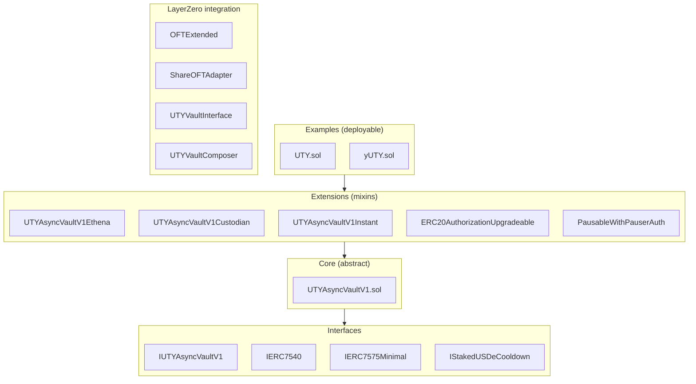

The YieldPoint contracts split into six directories under `src/`. This page shows the file layout, how the layers depend on each other, the inheritance chains for each vault, and a reference table of the key contract files.

## File layout

<Tree>
  <Tree.File name="UTYAsyncVaultV1.sol" />
  <Tree.Folder name="examples" defaultOpen>
    <Tree.File name="UTY.sol" />
    <Tree.File name="yUTY.sol" />
  </Tree.Folder>
  <Tree.Folder name="extensions" defaultOpen>
    <Tree.File name="ERC20AuthorizationUpgradeable.sol" />
    <Tree.File name="PausableWithPauserAuth.sol" />
    <Tree.File name="UTYAsyncVaultV1Custodian.sol" />
    <Tree.File name="UTYAsyncVaultV1Ethena.sol" />
    <Tree.File name="UTYAsyncVaultV1Instant.sol" />
  </Tree.Folder>
  <Tree.Folder name="interfaces">
    <Tree.File name="IERC7540.sol" />
    <Tree.File name="IERC7575Minimal.sol" />
    <Tree.File name="IStakedUSDeCooldown.sol" />
    <Tree.File name="IUTYAsyncVaultV1.sol" />
  </Tree.Folder>
  <Tree.Folder name="layerzero" defaultOpen>
    <Tree.File name="OFTExtended.sol" />
    <Tree.File name="ShareOFTAdapter.sol" />
    <Tree.File name="UTYVaultComposer.sol" />
    <Tree.File name="UTYVaultInterface.sol" />
    <Tree.Folder name="lib">
      <Tree.File name="VaultComposerSyncPatched.sol" />
    </Tree.Folder>
  </Tree.Folder>
  <Tree.Folder name="mocks">
    <Tree.File name="MockCustodianVault.sol" />
    <Tree.File name="MockEndpoint.sol" />
    <Tree.File name="MockERC20.sol" />
    <Tree.File name="MockInstantCustodianVault.sol" />
    <Tree.File name="MockInstantVault.sol" />
    <Tree.File name="MockMintableOFT.sol" />
    <Tree.File name="MockUTYAsyncVaultV1.sol" />
  </Tree.Folder>
</Tree>

## Layer dependency

The contracts are organized into four layers plus a LayerZero integration column. Examples at the top depend on Extensions, which depend on Core, which depends on Interfaces. LayerZero sits as a parallel column with its own internal structure.

Mocks under `src/mocks/` are test scaffolding and are not part of the runtime dependency graph.

## Vault inheritance

### UTYAsyncVaultV1 (abstract base)

The base vault inherits from seven upgradeable OpenZeppelin and YieldPoint contracts:

- `ERC4626Upgradeable`
- `ERC20AuthorizationUpgradeable` (EIP-3009)
- `Ownable2StepUpgradeable`
- `AccessControlEnumerableUpgradeable`
- `UUPSUpgradeable`
- `ReentrancyGuardUpgradeable`
- `PausableUpgradeable`

### UTY vault configuration

`UTY.sol` extends `UTYAsyncVaultV1` with two extensions plus an override:

- `UTYAsyncVaultV1Custodian` — adds the custodian sweep, `totalManagedAssets` tracking, `totalAssets()` override, and emergency write-down via `reduceTotalManagedAssets()`
- `UTYAsyncVaultV1Instant` — adds the instant redemption path below a configurable threshold
- `donate()` is overridden to revert

<Warning>
  **Why `donate()` reverts for UTY.** The UTY vault maintains a strict 1:1 peg with USDC. In a standard ERC-4626 vault, anyone can call `donate()` to add assets without minting shares, which increases the exchange rate for all shareholders. For UTY, this would break the 1:1 guarantee — if someone donated 1000 USDC, existing UTY holders would suddenly have shares worth more than 1 USDC each. By reverting on `donate()`, the UTY vault ensures the exchange rate can never deviate from 1.0. This is intentional and critical to UTY's design as a stablecoin, not a yield-bearing token. (The yUTY vault, by contrast, allows donations — this increases the exchange rate for existing shareholders, which is the desired behavior for a yield vault.)
</Warning>

### yUTY vault configuration

`yUTY.sol` extends `UTYAsyncVaultV1` directly, without the custodian or instant extensions:

- Async-only ERC-7540 vault — no instant redemption
- 7-day unbonding period for all withdrawals
- 18-decimal shares (no decimals offset; inflation defense via seed deposit)

## LayerZero contracts

The LayerZero integration layer splits between hub-side and spoke-side contracts.

### Hub-side (Base)

- `ShareOFTAdapter.sol` — OFT adapter wrapping the vault's share token. Uses the lockbox model: tokens sent cross-chain are locked in the adapter, not burned. Inherits `PausableWithPauserAuth` for bridge-level pause control.
- `UTYVaultComposer.sol` — handles incoming cross-chain `lzCompose` messages, executes vault operations on behalf of the caller, and manages refund recovery for failed composes. Extends `VaultComposerSyncPatched` (the YieldPoint patched version of the LayerZero base composer) and `Ownable2Step`.

### Spoke-side (Avalanche, Katana)

- `OFTExtended.sol` — the UTY and yUTY token representation on spoke chains. Mint/burn model: tokens arriving from the hub are minted, tokens leaving are burned. Extends `OFTUpgradeable`, `ERC20AuthorizationUpgradeable`, and `Ownable2StepUpgradeable`.
- `UTYVaultInterface.sol` — the spoke-chain proxy that makes yUTY deposits and redemptions feel local to a user on Avalanche or Katana. Charges flat fees on cross-chain calls (see [Tokens and fees](/protocol/architecture/tokens-and-fees)). Uses `AccessControl`, ERC-7201 namespaced storage, and maintains a per-user pending-claims counter that prevents double-spending of claim credits.

## Key contract files

| Contract | Purpose | Deployment |
|---|---|---|
| `UTYAsyncVaultV1.sol` | Base vault implementation (abstract) | Hub only |
| `UTYAsyncVaultV1Custodian.sol` | Custodian sweep + `fundRedemptions` extension | Hub only |
| `UTYAsyncVaultV1Instant.sol` | Instant redemption extension | Hub only (UTY) |
| `PausableWithPauserAuth.sol` | Bridge-level pause (ERC-7201 namespaced) | Hub only |
| `ERC20AuthorizationUpgradeable.sol` | EIP-3009 implementation | All chains |
| `UTYVaultComposer.sol` | Cross-chain message handler + refund recovery | Hub only |
| `UTYVaultInterface.sol` | Spoke vault proxy + access control + flat fees + pending-claims counter | Spoke chains |
| `OFTExtended.sol` | Extended OFT token (UTY/yUTY on spokes) | Spoke chains |
| `ShareOFTAdapter.sol` | Hub OFT lockbox + bridge-level pause | Hub only |

## Example contracts

The `src/examples/` directory contains concrete implementations ready for deployment:

| Contract | Description | Extends |
|---|---|---|
| `UTY.sol` | Unity stablecoin vault (1:1 USDC peg, custodian sweep, instant redemption) | `UTYAsyncVaultV1`, `UTYAsyncVaultV1Instant`, `UTYAsyncVaultV1Custodian` |
| `yUTY.sol` | Yield-bearing vault shares for UTY (async-only, no instant redemption) | `UTYAsyncVaultV1` |

These contracts include hardcoded names, symbols, and default configuration (7-day bonding period, unlimited max assets).
