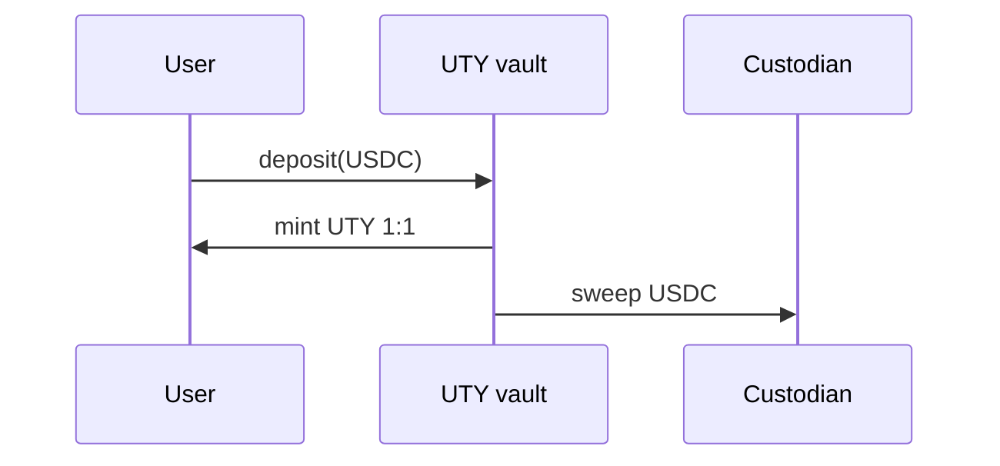
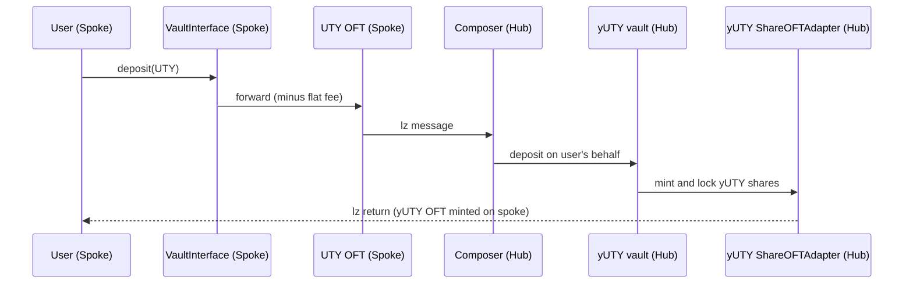
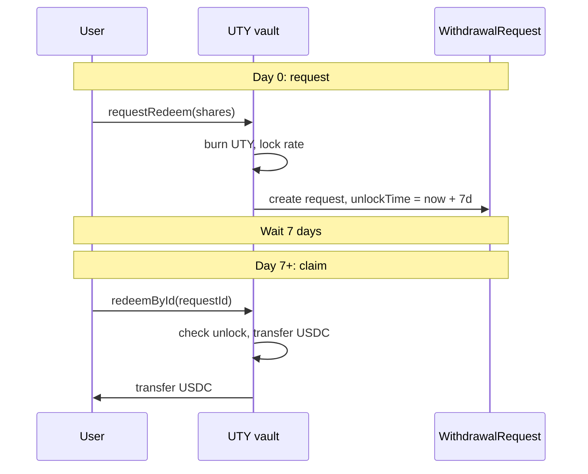
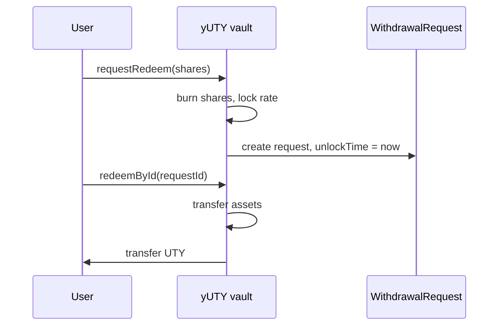
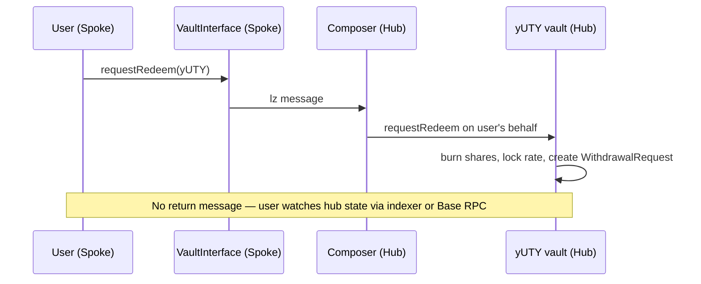
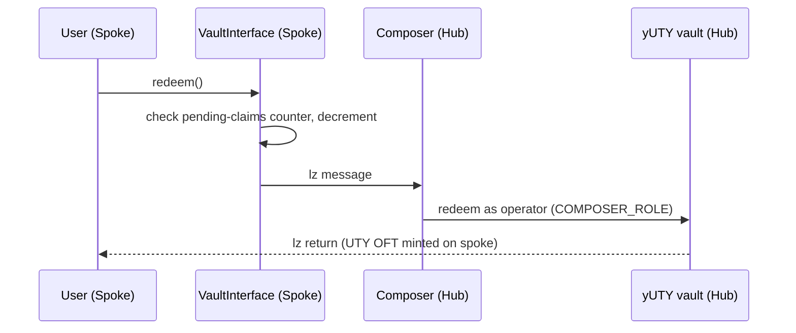

YieldPoint has five core operation flows: UTY deposit (direct on Base), yUTY deposit from a spoke chain, UTY redemption, yUTY redemption, and cross-chain redemption. This page walks through each one.

All cross-chain flows show the spoke column generically as "Spoke chain" — the flow is identical whether the user is on Avalanche or Katana.

## UTY deposit

The simplest flow. You deposit USDC on Base, the UTY vault mints UTY 1:1, and the USDC is swept to the custodian wallet.

<Steps>
  <Step title="User deposits USDC">
    You call `deposit(assets, receiver)` on the UTY vault with an equal amount of USDC pre-approved.
  </Step>
  <Step title="Vault mints UTY">
    The vault mints UTY 1:1 against the deposited USDC. No share price math — UTY maintains a strict 1:1 peg with USDC.
  </Step>
  <Step title="USDC sweeps to custodian">
    The vault transfers the deposited USDC to the custodian wallet immediately. This is the custodian extension (`UTYAsyncVaultV1Custodian`) that tracks `totalManagedAssets` for the off-chain-held portion of the backing.
  </Step>
</Steps>

## yUTY deposit (cross-chain)

From a spoke chain, you deposit UTY into the yUTY vault. The call routes through the spoke `VaultInterface`, over LayerZero to the hub composer, into the vault, and the resulting yUTY shares bridge back to your address on the spoke.

<Steps>
  <Step title="User deposits UTY on spoke">
    You call `deposit(assets, receiver)` on the spoke `yUTY VaultInterface` with an equal amount of UTY pre-approved. The interface deducts its flat deposit fee and forwards the remaining UTY cross-chain.
  </Step>
  <Step title="Composer executes on hub">
    The UTY OFT relays the message via LayerZero to the hub composer. The composer's `lzCompose` handler calls `deposit` on the yUTY vault on your behalf.
  </Step>
  <Step title="yUTY bridges back">
    The yUTY shares minted by the vault are locked in the `yUTY ShareOFTAdapter` and a LayerZero message mints the equivalent yUTY OFT supply to your address on the spoke chain.
  </Step>
</Steps>

<Note>
  **There is no cross-chain UTY deposit flow.** UTY can only be minted on Base by depositing USDC directly to the UTY vault. Once minted, UTY can be bridged to spoke chains and used to mint yUTY cross-chain via the flow above.
</Note>

## UTY redemption

UTY redemption uses a 7-day async bonding path. You call `requestRedeem` on Base, the vault burns your UTY and creates a `WithdrawalRequest` with `unlockTime = now + 7 days`. Once the bonding period elapses, you call `redeemById(requestId)` to receive USDC from the vault's on-chain buffer.

<Note>
  **UTY redemption is Base-only.** To redeem UTY for USDC you need to be on Base. If you hold UTY on a spoke chain, bridge it to Base first, then call `requestRedeem` on the hub vault.
</Note>

## yUTY redemption

yUTY redemption is instant on the hub chain. You call `requestRedeem`, the vault burns your shares and creates a `WithdrawalRequest` with no bonding delay. The matching `redeemById(requestId)` call is available in the same block and transfers the underlying UTY to you.

<Note>
  **ERC-7540 flow, no bonding delay.** yUTY still follows the ERC-7540 async pattern with separate request and claim calls, so off-chain tooling built against the standard works unchanged. The bonding period is a vault configuration; it's currently set to 0, which makes the claim call available immediately. When shares are burned at request time, the exchange rate is locked — any yield accrual between request and claim accrues to remaining shareholders.
</Note>

## Cross-chain redemption

From a spoke chain, requesting a yUTY redemption is a two-phase flow. The request sends the redemption cross-chain to the hub, where shares are burned. The claim is a separate spoke-originated transaction that instructs the hub composer to settle the withdrawal request and bridge UTY back to the user on the spoke.

The request phase looks like this:

Once the hub-side request confirms (typically 10–60 seconds via LayerZero), the claim phase routes back through the spoke interface and composer:

The composer holds the `COMPOSER_ROLE` on the vault, which allows it to act as an operator for any user's claim. The spoke `VaultInterface` maintains a per-user pending-claims counter that prevents double-spending of claim credits.
