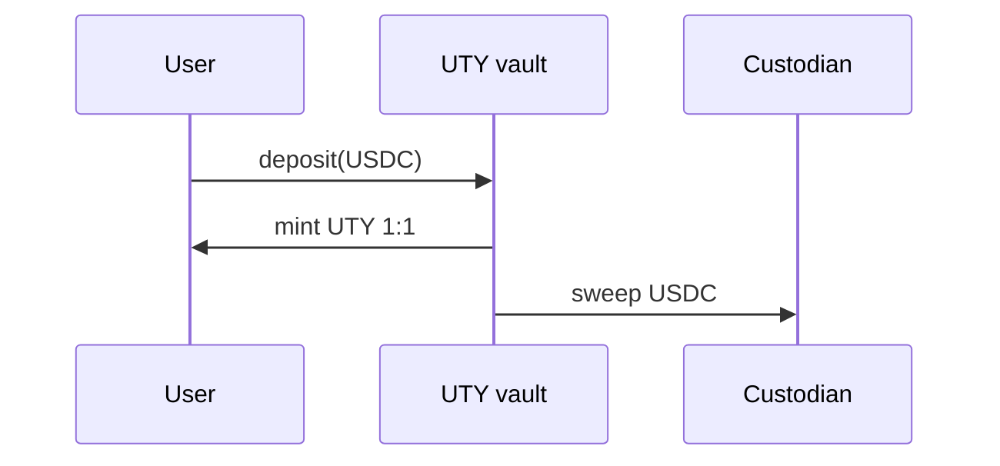
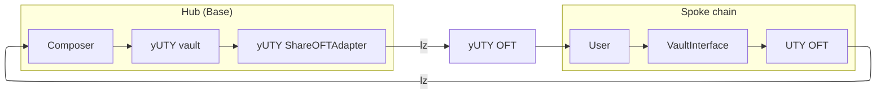
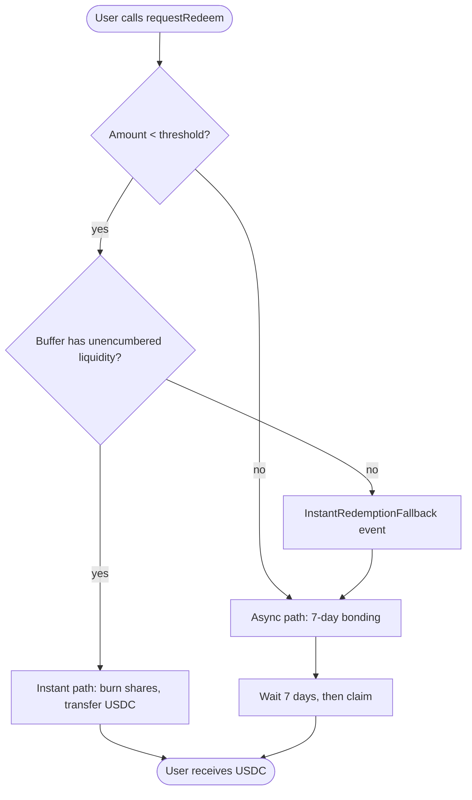
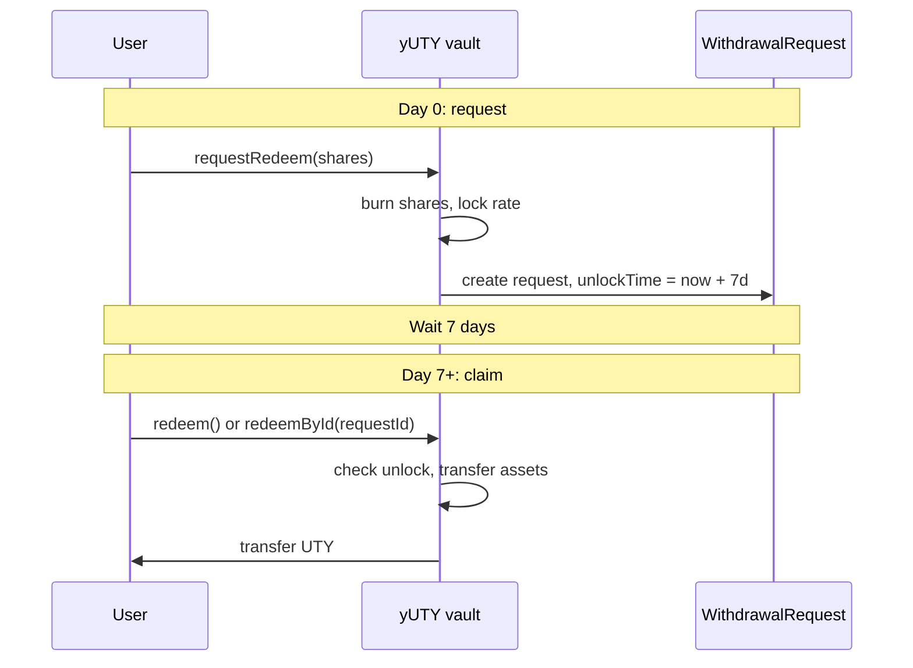
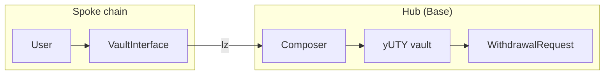
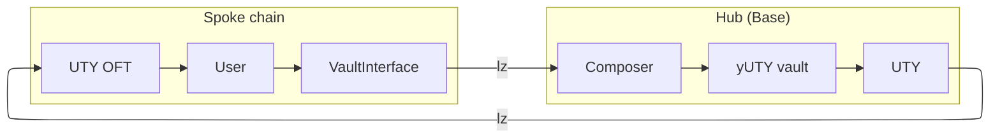

YieldPoint has five core operation flows: UTY deposit (direct on Base), yUTY deposit from a spoke chain, UTY redemption (with an optional instant path), yUTY async redemption, and cross-chain redemption. This page walks through each one.

All cross-chain flows show the spoke column generically as "Spoke chain" — the flow is identical whether the user is on Avalanche or Katana.

## UTY deposit

The simplest flow. You deposit USDC on Base, the UTY vault mints UTY 1:1, and the USDC is swept to the custodian wallet.

<Steps>
  <Step title="User deposits USDC">
    You call `deposit(assets, receiver)` on the UTY vault with an equal amount of USDC pre-approved.
  </Step>
  <Step title="Vault mints UTY">
    The vault mints UTY 1:1 against the deposited USDC. No share price math — UTY maintains a strict 1:1 peg with USDC.
  </Step>
  <Step title="USDC sweeps to custodian">
    The vault transfers the deposited USDC to the custodian wallet immediately. This is the custodian extension (`UTYAsyncVaultV1Custodian`) that tracks `totalManagedAssets` for the off-chain-held portion of the backing.
  </Step>
</Steps>

## yUTY deposit (cross-chain)

From a spoke chain, you deposit UTY into the yUTY vault. The call routes through the spoke `VaultInterface`, over LayerZero to the hub composer, into the vault, and the resulting yUTY shares bridge back to your address on the spoke.

<Steps>
  <Step title="User deposits UTY on spoke">
    You call `deposit(assets, receiver)` on the spoke `yUTY VaultInterface` with an equal amount of UTY pre-approved. The interface deducts its flat deposit fee and forwards the remaining UTY cross-chain.
  </Step>
  <Step title="Composer executes on hub">
    The UTY OFT relays the message via LayerZero to the hub composer. The composer's `lzCompose` handler calls `deposit` on the yUTY vault on your behalf.
  </Step>
  <Step title="yUTY bridges back">
    The yUTY shares minted by the vault are locked in the `yUTY ShareOFTAdapter` and a LayerZero message mints the equivalent yUTY OFT supply to your address on the spoke chain.
  </Step>
</Steps>

<Note>
  **There is no cross-chain UTY deposit flow.** UTY can only be minted on Base by depositing USDC directly to the UTY vault. Once minted, UTY can be bridged to spoke chains and used to mint yUTY cross-chain via the flow above.
</Note>

## UTY redemption routing

Redemption has two paths. If the UTY vault has a non-zero instant redemption threshold configured and your redeem amount is below it, the vault attempts an instant redeem from its on-chain USDC buffer. Otherwise (or if the buffer lacks sufficient unencumbered liquidity), the request enters the 7-day async bonding path.

<Warning>
  **Instant path falls back to async, never reverts.** When the vault's on-chain USDC buffer lacks enough unencumbered liquidity to satisfy an instant redemption (i.e., `balance - pendingWithdrawals < assets`), the request falls back into the async path instead of reverting. The vault emits an `InstantRedemptionFallback` event so off-chain tooling can distinguish fallback-routed requests from natively-async requests.
</Warning>

## yUTY async redemption

yUTY has no instant path — all redemptions go through the 7-day bonding period. On day 0 you lock your shares and a withdrawal request is created; on day 7 or later you claim your assets.

<Note>
  **7-day bonding period.** The bonding period is fixed at 7 days for the default yUTY vault configuration. Once shares are burned on day 0, the exchange rate is locked — any yield accrual between the request and the claim accrues to remaining shareholders, not to the withdrawing user.
</Note>

## Cross-chain redemption

From a spoke chain, requesting a yUTY redemption is a two-phase flow: day 0 sends the request cross-chain to the hub, and day 7+ the user claims from the spoke via a second cross-chain call that uses the composer as a vault operator.

The request phase looks like this:

After the 7-day bonding period, the claim phase routes back through the spoke interface and composer:

The composer holds the `COMPOSER_ROLE` on the vault, which allows it to act as an operator for any user's claim. The spoke `VaultInterface` maintains a per-user pending-claims counter that prevents double-spending of claim credits.
