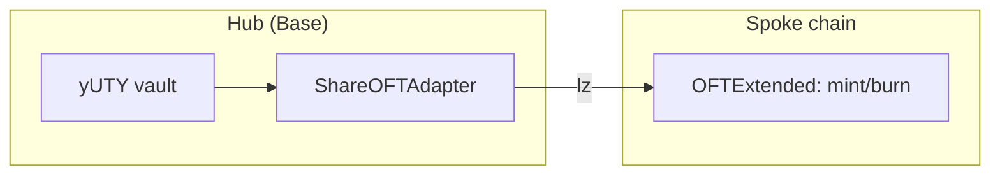

This page covers how UTY and yUTY tokens move between chains (the OFT pattern) and the flat fees that the spoke-chain `UTYVaultInterface` charges to cover LayerZero messaging costs.

## OFT pattern

UTY and yUTY implement LayerZero's Omnichain Fungible Token (OFT) pattern. The token contract on the hub chain is different from the token contract on spoke chains — different roles, different storage, different responsibilities.

<Tabs>
  <Tab title="Hub (Base)">
    - The vault contract IS the token. `UTY` and `yUTY` are both ERC-7540 vaults that extend ERC-20, so the share token is the vault itself.
    - `ShareOFTAdapter` wraps the vault token for cross-chain transfers using the **lockbox model**: tokens sent cross-chain are locked in the adapter, not burned.
    - Redeeming a cross-chain transfer releases the locked tokens back to the recipient.
  </Tab>
  <Tab title="Spoke chains">
    - `OFTExtended` represents the token on each spoke chain. No vault logic — just a fungible token.
    - Uses the **mint/burn model**: tokens arriving from the hub are minted on the spoke; tokens leaving the spoke are burned.
    - Spoke-chain balances are local. The global supply is the sum of the hub-side vault's `totalSupply()` and the spoke-side mint/burn balances.
  </Tab>
</Tabs>

<Warning id="spoke-only-safety">
  **Why spoke-only deployment matters for fee collection.** The `UTYVaultInterface` on spoke chains collects flat fees by holding a small token balance and sweeping it via `balanceOf(address(this))`. This is only safe with mint/burn OFTs, where the only tokens sitting in the contract are collected fees. If the interface were deployed alongside a lockbox adapter (which holds locked user funds), user deposits would be indistinguishable from fee balances and could be swept by the owner. The `UTYVaultInterface` must never be deployed on a chain that uses OFT adapters. The `initialize()` function enforces this by checking `approvalRequired()` on both OFTs — OFT adapters return `true` (lockbox needs approval), native OFTs return `false` (mint/burn). If either check returns `true`, initialization reverts with `OFTAdapterNotSupported()`.
</Warning>

The model is different across layers but the user experience is uniform: a user on Avalanche holds UTY in a single wallet address and transfers it like any ERC-20, regardless of whether the underlying is a lockbox-locked adapter token (on the hub) or a locally-minted OFT (on a spoke).

Hub uses lock/unlock; spoke uses mint/burn. LayerZero messages carry the token movement between them.

## EIP-3009 support

All YieldPoint tokens — hub vaults (`UTY`, `yUTY`) and spoke OFTs (`OFTExtended`) — support EIP-3009's `transferWithAuthorization`. This enables signature-based transfers without requiring a prior `approve` call: a user signs an authorization off-chain, and anyone (e.g., a relayer or an agentic system) can submit it to execute the transfer.

This enables x402 payment protocol support for agentic transactions — any EIP-3009-compatible token can act as the payment rail for x402 flows.

## Flat fee model

The spoke-chain `UTYVaultInterface` charges flat fees on cross-chain deposits and redemptions. These fees cover the LayerZero messaging cost for the spoke-to-hub and hub-to-spoke round trip.

| Parameter | Token | Default | Maximum | Rationale |
|---|---|---|---|---|
| `depositFlatFee` | UTY | `0.14 UTY` (`140000000000000000`) | `MAX_DEPOSIT_FEE` (`5e18` = 5 UTY) | Covers spoke-to-hub + hub-to-spoke LayerZero gas for a deposit round trip. |
| `redeemFlatFee` | yUTY | `0.21 yUTY` (`210000000000000000`) | `MAX_REDEEM_FEE` (`5e18` = 5 yUTY) | Covers spoke-to-hub + hub-to-spoke LayerZero gas for a redeem round trip. |

<Note>
  **Why flat, not percentage.** LayerZero costs are per-message (~$0.06–$0.11 at current gas prices), not per-amount. A percentage fee would create a cross-user subsidy where large deposits overpay and dust deposits underpay. Flat fees with a small buffer achieve break-even regardless of deposit size, and the same fee funds the return message.
</Note>

### Fee caps

Both fees have hard-coded maximum constants:

- `MAX_DEPOSIT_FEE` = `5e18` (5 UTY in OFT token units)
- `MAX_REDEEM_FEE` = `5e18` (5 yUTY in OFT token units)

The `setDepositFlatFee()` and `setRedeemFlatFee()` functions revert with `FeeExceedsMaximum` if the new fee exceeds the cap. This limits admin abuse even if the fee manager key is compromised — the worst-case scenario is 5 tokens per operation, not arbitrary.

## Fee collection and withdrawal

Fees are collected using a `balanceOf(address(this))` sweep model:

<Steps>
  <Step title="User calls deposit on the spoke VaultInterface">
    The full `assets` amount is transferred from the user into the `VaultInterface` contract.
  </Step>
  <Step title="VaultInterface bridges the post-fee amount">
    Only `assets - depositFlatFee` is bridged cross-chain via the OFT. The fee stays behind as a token balance in the `VaultInterface` contract.
  </Step>
  <Step title="Fee accumulates in the contract balance">
    Over time, the `VaultInterface` contract's `balanceOf(address(this))` grows as each deposit leaves its fee behind.
  </Step>
  <Step title="Operations role sweeps the balance">
    An address with `OPERATIONS_ROLE` (or the owner) calls `withdrawFees(token, recipient)` to sweep the entire balance to a recipient wallet.
  </Step>
</Steps>

There are no accumulator variables and no drift. The sweep reads `balanceOf(address(this))` at withdrawal time. This saves ~5,000 gas per deposit versus maintaining a running total.

<Warning id="sweep-model-safety">
  **Safety constraint.** This sweep model is ONLY safe with mint/burn OFTs. With a lockbox OFT (`OFTAdapter`), user funds locked for bridging would be indistinguishable from fee balances. See [Spoke-only deployment safety](#spoke-only-safety) for the constructor-time check that enforces this invariant.
</Warning>

## Fee management roles

Three operations are gated by role, and each can be performed by either the contract owner or an address holding `OPERATIONS_ROLE`:

| Action | Who |
|---|---|
| Set deposit fee | Owner or `OPERATIONS_ROLE` |
| Set redeem fee | Owner or `OPERATIONS_ROLE` |
| Withdraw fees | Owner or `OPERATIONS_ROLE` |

Fees are set per-chain at deploy time via the `initialize()` parameters, allowing different fee levels for chains with different gas costs. As of the current deployment, Avalanche and Katana use identical fees (0.14 UTY deposit, 0.21 yUTY redeem).
