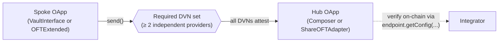

<Note>
  If you haven't read the [Overview](/protocol/integration/overview), the `VaultInterface`, OFT adapter, and hub/spoke mental model are defined there. Start at the Overview if any terms below read as unfamiliar.
</Note>

YieldPoint's cross-chain story is built on LayerZero V2. UTY and yUTY travel between Base, Avalanche, and Katana as OFTs; vault operations that originate on a spoke (deposit yUTY, request redeem, claim) reach the hub via LayerZero compose messages. This page covers the trust model, the verification recipe, the token-bridging walkthroughs, and the protocol-level defenses that sit on top of LayerZero's verification layer.

## DVN trust model

Every cross-chain pathway is configured with a required threshold of **at least 2 independent DVNs** (Decentralized Verifier Networks). No single DVN can forge a message. Providers are public, audited infrastructure operators:

| Pathway | Required DVNs |
|---|---|
| Base ↔ Avalanche | LayerZero Labs + Google Cloud |
| Base ↔ Katana | LayerZero Labs + Nethermind |

There is no single point of failure in the bridge — a compromise of any one DVN operator's key is not sufficient to pass verification.

## Verify the DVN configuration yourself

DVN configuration is on-chain state, not something you should take on faith from docs. To verify the threshold and providers for a pathway, call `getConfig` on the LayerZero V2 endpoint:

```solidity
// On the chain you want to verify (e.g., Base)
// Returns the encoded ULN (UltraLightNode) config for the given pathway
bytes memory config = ILayerZeroEndpointV2(endpoint).getConfig(
    oApp,          // The YieldPoint OApp address on this chain (adapter, OFT, or composer)
    sendOrReceiveLib, // The send or receive library address for this pathway
    remoteEid,     // The LayerZero endpoint ID of the remote chain
    uint32(2)      // CONFIG_TYPE_ULN
);

UlnConfig memory uln = abi.decode(config, (UlnConfig));
// uln.requiredDVNCount -- must be >= 2
// uln.requiredDVNs      -- both entries must be populated and non-zero
// uln.confirmations     -- block confirmations required before the message can be verified
```

**Pass criterion.** A healthy YieldPoint pathway satisfies:

- `uln.requiredDVNCount >= 2`
- Every entry in `uln.requiredDVNs` is populated and non-zero
- `uln.confirmations` is non-zero (block-finality requirement)

If any of those fails, the pathway is misconfigured and you should not rely on it.

**Endpoint addresses.** LayerZero maintains the [canonical registry of V2 endpoints](https://docs.layerzero.network/v2/deployments/deployed-contracts). Look up the endpoint for your chain there; this guide intentionally does not inline any endpoint, DVN, or library addresses because that information drifts and the registry is authoritative.

## Bridge UTY or yUTY between chains

UTY and yUTY both use LayerZero's OFT standard. The hub (Base) side is a **lockbox adapter** (`ShareOFTAdapter`): tokens sent cross-chain are locked in the adapter, not burned. The spoke side is a **mint/burn OFT** (`OFTExtended`): tokens arriving from the hub mint; tokens leaving burn.

### Base → spoke

1. Call `send()` on the hub adapter for the token you're sending: `UTY ShareOFTAdapter` (on Base) for UTY, `yUTY ShareOFTAdapter` (on Base) for yUTY.
2. The adapter locks your tokens on Base and submits a LayerZero message.
3. On arrival at the spoke, the OFT mints the equivalent amount to the receiver address you specified.

### Spoke → Base

1. Call `send()` on the spoke OFT for the token you're sending: `UTY OFTExtended` (on the spoke) for UTY, `yUTY OFTExtended` (on the spoke) for yUTY.
2. The spoke OFT burns your tokens and submits a LayerZero message.
3. On arrival at Base, the hub adapter unlocks the equivalent amount from its lockbox to the receiver address.

The adapter/OFT pair differs by token (UTY has its own adapter and OFTs; yUTY has its own). The [Contracts page](/protocol/architecture/contracts) lists the deployed addresses per chain.

## Gas sponsorship

The protocol sponsors return-hop LayerZero fees for cross-chain vault operations. Users and integrators pay only the first-hop native fee on the originating chain; the protocol pays the return-hop fee from gas tanks maintained on each spoke `VaultInterface` and on the hub `UTYVaultComposer`. This is what lets the spoke `VaultInterface` preserve the ERC-7540 nonpayable signatures exactly — partners can call `deposit` and `requestRedeem` on a spoke without attaching `msg.value` for cross-chain fees.

Under normal operation the gas tanks are funded and monitored by YieldPoint ops; partners don't manage tank balances day-to-day. The failure mode matters for integrator design:

<Warning>
  **If a gas tank is empty**, the cross-chain message reverts with `InsufficientFunds(availableFunds, requiredFunds)` at the originating contract (either the spoke `VaultInterface` for outbound messages, or the hub `UTYVaultComposer` for return-hop messages). Funds are not lost — the LayerZero message is queued at the endpoint and retries are permissionless — but the integration-facing signal is "my transaction reverted" or "the return-hop event never arrived within the expected latency window." See [Gotchas: `InsufficientFunds`](/protocol/integration/gotchas#insufficientfunds-from-gas-tank-depletion) for detection and recovery.
</Warning>

## Latency and observability

Cross-chain messages typically settle in under a minute for a full spoke → hub → spoke round trip. **No SLA.** Latency depends on DVN liveness, destination chain congestion, and executor queue depth — none of which the protocol controls.

Rather than blocking on a return message, watch on-hub state via an indexer or a Base RPC. The cross-chain event correlation recipe (spoke `GasTankDebited.guid` → hub `RedeemRequest` or hub composer `GasTankDebited`) lives in the [Base operations event reference](/protocol/integration/base-operations#event-reference) — that page is the canonical home; use the `guid` field as your correlation key.

## Protocol-level defenses beyond DVN verification

LayerZero's multi-DVN verification handles message authenticity. YieldPoint layers additional protocol-level defenses on top, covered briefly here:

- **Trusted remotes on the Composer.** `UTYVaultComposer` validates incoming `lzCompose` messages against a `trustedRemotes` mapping. Messages from unregistered spoke contracts are rejected outright — an attacker who compromises every DVN still can't get a message processed unless they originate it from a registered `VaultInterface`.
- **Per-vault `COMPOSER_ROLE`.** The hub vault grants `COMPOSER_ROLE` to exactly one `UTYVaultComposer` per vault. There is no cross-vault authority — a bug in one composer cannot act on another vault.
- **Bridge-level pause.** `ShareOFTAdapter` inherits `PausableWithPauserAuth`. Admin EOAs can pause cross-chain share-token transfers as an emergency control, independent of the vault's own pause.
- **Per-controller pending-claims counter.** Each spoke `VaultInterface` tracks a per-controller counter: `requestRedeem` increments it; `redeem` requires it to be `> 0` and decrements it. Without a prior request, a `redeem` call on the spoke reverts with `NoPendingClaim` — this prevents zero-cost gas-tank drain attacks.

## Cross-chain trust model

The diagram below shows a cross-chain message flow with the required-DVN verification step highlighted. A message from a spoke OApp must be signed by every DVN in the required-DVN set before the hub OApp accepts it; the threshold is at least 2 and the required-DVNs list must be populated with non-zero addresses (the pass criterion from the verification recipe above).



*Figure: Cross-chain message flow with required-DVN verification. A message leaves the spoke OApp, passes through the required-DVN verification set (each DVN independently attests), and arrives at the hub OApp only after the threshold is met. Integrators verify the DVN configuration directly on-chain via `endpoint.getConfig` — the recipe above returns the `UlnConfig` struct with the current thresholds and providers.*
