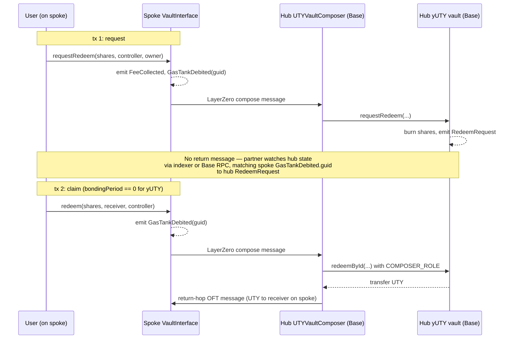

<Note>
  This page assumes you've read [Base operations](/protocol/integration/base-operations). Spoke chains hold no vault state — they proxy calls cross-chain to the hub on Base via LayerZero. The ERC-7540 request/claim pattern and the canonical function and event references are on the Base operations page.
</Note>

A spoke integration is a cross-chain integration by construction: every spoke-originated operation crosses LayerZero at least once, and some operations cross it twice (deposit back, claim back). This page covers the flows an integrator on Avalanche or Katana touches, the inline access-control semantics of the spoke `VaultInterface`, and the gotcha that trips up most partners (the `controller` parameter).

## Upfront notes

- Cross-chain round trips typically settle in under a minute. **No SLA.** See [Bridge operations](/protocol/integration/bridge-operations#latency-and-observability) for the latency discussion.
- The spoke `VaultInterface` address differs per spoke (one on Avalanche, one on Katana). They are not the same contract. Look up the current addresses on the [Contracts page](/protocol/architecture/contracts); do not hard-code them from another source.
- **UTY vault mint (USDC → UTY) and redeem (UTY → USDC) are not available from a spoke.** The UTY token itself bridges freely via OFT (see [Bridge operations](/protocol/integration/bridge-operations#bridge-uty-or-yuty-between-chains)) — it's only the vault operations against USDC that are Base-only.

## Why UTY mint/redeem is Base-only

<Info>
  The UTY vault uses the `UTYAsyncVaultV1Custodian` extension (introduced on [Base operations](/protocol/integration/base-operations)): the custodian sweeps deposited USDC to an off-chain wallet and the vault tracks `totalManagedAssets` for the off-chain portion. USDC settlement runs through the custodian on Base — there's no cross-chain equivalent. If you hold UTY on a spoke and want USDC, bridge UTY to Base first (see [Bridge operations](/protocol/integration/bridge-operations#spoke-base)), then call `UTY.requestRedeem` on the hub.
</Info>

## Deposit yUTY from a spoke

One user transaction initiates the flow; the protocol handles the hub-side deposit and the return hop.

<Steps>
  <Step title="Approve UTY">
    `UTY.approve(VAULT_INTERFACE, amount)` on the spoke. The `VaultInterface` address is specific to the spoke.
  </Step>
  <Step title="Deposit">
    `VaultInterface.deposit(assets, receiver, controller)` on the spoke. The three-arg form enforces `_checkInputIsSender(controller)` — `controller` must equal `msg.sender`. The two-arg form `deposit(assets, receiver)` is permissionless and is usually the right choice when a user is depositing for themselves.
  </Step>
  <Step title="Flat deposit fee deducted">
    The `VaultInterface` takes a flat deposit fee in UTY (see `depositFlatFee()` for the current value) and forwards the remaining UTY cross-chain.
  </Step>
  <Step title="Hub composer completes the deposit">
    The hub `UTYVaultComposer` receives the compose message, calls `yUTY.deposit` on the vault on the user's behalf, and mints yUTY shares.
  </Step>
  <Step title="yUTY shares bridge back to the spoke">
    The vault mints shares into the yUTY `ShareOFTAdapter` lockbox, which emits a LayerZero message back to the originating spoke. On arrival, the spoke yUTY OFT mints the shares to the `receiver` address. Protocol pays this return-hop LZ fee from the hub Composer's gas tank.
  </Step>
</Steps>

Partners watching for deposit settlement should subscribe to the hub composer's `GasTankDebited` event on Base — that `guid` is the signal that the return-hop message has been paid for. The spoke yUTY OFT also emits an OFT receive event when the shares arrive. See [Base operations event reference](/protocol/integration/base-operations#event-reference) for the full correlation recipe.

## Controller-safety warning

<Warning>
  Passing a contract address as `controller` on a spoke `requestRedeem` call will permanently prevent that contract from claiming on the spoke. Spoke `redeem()` enforces `msg.sender == controller` with no operator-delegation path, and the hub-side recovery primitive `setOperator` cannot save a contract-as-controller integrator (see [Gotchas: multi-spoke origin tracking](/protocol/integration/gotchas#multi-spoke-origin-tracking)). **If your contract needs users to claim from the spoke, pass the user's EOA as `controller` at request time.** This is the single most common partner integration bug.
</Warning>

## Spoke claim constraints

The spoke `UTYVaultInterface` exposes only one claim function — `redeem(shares, receiver, controller)`. The richer hub claim API is **not available on spokes**:

- **No `withdraw(assets, ...)`** — claims from spokes are share-denominated only. Partners that need to target a specific asset payout amount must claim on the hub, or convert the desired asset amount to shares before calling spoke `redeem`.
- **No `redeemById(...)`** — spokes cannot target a specific request. The hub composer always invokes the aggregating `redeem(shares, ...)` loop on the vault, so requests are consumed in storage order. Partners doing per-request accounting (gauges, vault-of-vaults) must keep that accounting on the hub and use [`redeemById`](/protocol/integration/base-operations#hub-claim-paths) directly on Base.

Operator delegation is also unavailable on spokes — see the [Controller-safety warning](#controller-safety-warning) above for the recovery story.

UTY has no spoke claim path at all. UTY claims are Base-only regardless of which chain the holder is on; bridge UTY to Base first, then call `redeemById` (or `redeem` / `withdraw`) on the hub vault.

## Withdraw yUTY from a spoke

yUTY spoke withdrawal is **two user transactions** — the protocol doesn't round-trip a settlement message, so there's no way to combine request and claim into a single tx. Between the two, the user (or their integration) watches hub state for settlement.

<Steps>
  <Step title="Approve yUTY">
    `yUTY.approve(VAULT_INTERFACE, shares)` on the spoke.
  </Step>
  <Step title="Request (tx 1)">
    `VaultInterface.requestRedeem(shares, controller, owner)` on the spoke. Enforces `_checkInputIsSender(owner)` — `owner` must equal `msg.sender`. `controller` is arbitrary (that's how Pattern 2 works: pass the user's EOA so the user can claim from the spoke directly). A flat redeem fee is deducted from `shares` before bridging; see the fee guard below.
  </Step>
  <Step title="Wait for hub settlement">
    No return message is sent. Partners watch on-hub state via indexer or Base RPC; the correlation recipe lives in the [Base operations event reference](/protocol/integration/base-operations#event-reference) — use the spoke `GasTankDebited.guid` to match the hub `RedeemRequest`.
  </Step>
  <Step title="Claim (tx 2)">
    `VaultInterface.redeem(shares, receiver, controller)` on the spoke. Enforces `_checkInputIsSender(controller)` — `controller` must equal `msg.sender`; **no operator delegation on spokes**. The claim sends a second cross-chain message; the hub composer calls the vault's aggregating `redeem(shares, address(this), controller)` using its `COMPOSER_ROLE`; UTY bridges back to the spoke to the `receiver` address. For yUTY the bonding period is `0`, so this tx can run as soon as the hub confirms the request — typically within a minute of tx 1.

    Each spoke `redeem` call consumes exactly one matured-request slot regardless of share size, so a controller with N matured requests on this spoke needs N spoke `redeem` calls. See [Gotchas: `NoPendingClaim()`](/protocol/integration/gotchas#nopendingclaim-on-the-spoke) for the failure mode if a caller assumes one large `redeem` will drain multiple requests.
  </Step>
</Steps>

<Warning>
  **Multi-spoke claim coordination.** If the same controller has pending withdrawal requests on more than one spoke, the hub processes them in FIFO order regardless of origin chain — a `redeem` call from one spoke can consume a request that originated from another. This guide does not support the multi-spoke-concurrent-request pattern. See [Gotchas: multi-spoke origin tracking](/protocol/integration/gotchas#multi-spoke-origin-tracking).
</Warning>

## Fee-underflow guard

<Note>
  The flat deposit fee and flat redeem fee are deducted from the amount before bridging. If the amount is less than or equal to the fee, the call reverts with `FeeExceedsAmount(fee, amount)` — named `fee` and `amount` fields, easy to match on. Read `redeemFlatFee()` or `depositFlatFee()` to get the current fee and require strict inequality: `shares > redeemFlatFee()` for requestRedeem, `assets > depositFlatFee()` for deposit.
</Note>

## Preview reads are hub-only

Spokes hold no vault state, so every read function that inspects vault accounting (`previewRequestRedeem`, `convertToAssets`, `convertToShares`, `totalAssets`, `getBondingPeriod`, `getWithdrawalRequests(controller, offset, limit)` — note the three-arg signature) is only callable on the hub vault on Base. Integrators previewing a redemption or reading withdrawal-request state must RPC against Base. The canonical function signatures and return shapes are on the [Base operations function reference](/protocol/integration/base-operations#function-reference).

## Spoke event reference

The spoke `VaultInterface` emits no per-request event. To correlate a spoke request to its hub-side settlement, use the cross-chain event correlation recipe in the [Base operations event reference](/protocol/integration/base-operations#event-reference) — the spoke's `GasTankDebited` event carries the OFT message `guid` that ties the spoke-side transaction to the hub's `RedeemRequest` (for withdrawal) or the hub composer's `GasTankDebited` (for deposit return-hops).

Events emitted on the spoke:

| Event | When it fires |
|---|---|
| `FeeCollected(token, amount)` | Flat fee taken on a deposit or redeem request |
| `FeesWithdrawn(token, recipient, amount)` | Operations sweeps accumulated fees |
| `FlatFeeUpdated(feeType, oldValue, newValue)` | Fee parameter change |
| `GasTankFunded(remainingBalance)` | Native token sent to the spoke interface |
| `GasTankDebited(guid, operationType, remainingBalance)` | Each outbound LayerZero message from the spoke — the **correlation key** for cross-chain tracing |
| `GasTokensRecovered(to, amount, remainingBalance)` | Operations withdraws excess native from the gas tank |

## Cross-chain withdrawal flow

The diagram below traces a yUTY withdrawal initiated on a spoke. The gap in the middle marks the asynchronous boundary: after tx 1 returns, the protocol does not send a settlement message back — partners watch hub state (via indexer or Base RPC) and initiate tx 2 when they see the hub's `RedeemRequest` event. For yUTY the bonding period is 0, so tx 2 can run as soon as the hub-side request confirms.

*Figure: yUTY withdrawal from a spoke chain. Two user transactions bracket an indexer-watched gap. The protocol pays the return-hop gas (tx 2) from the hub Composer's gas tank on Base.*
